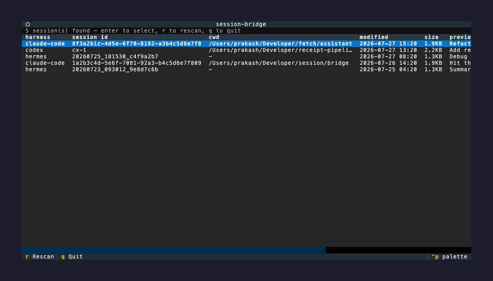

# session-bridge

[](https://github.com/connectwithprakash/agent-session-bridge/actions/workflows/test.yml)
[](https://pypi.org/project/agent-session-bridge/)
[](https://pypi.org/project/agent-session-bridge/)
[](LICENSE)

Local-first, cross-harness **agent-session portability**. Export a coding-agent
session from one harness and resume it in another when the original hits a usage
limit or otherwise stops.

Supports three harnesses today:

| Harness | Session store |
|---|---|
| Claude Code | `~/.claude/projects/<encoded-cwd>/<uuid>.jsonl` |
| Codex | `~/.codex/sessions/YYYY/MM/DD/rollout-*.jsonl` |
| Hermes | `~/.hermes/sessions/<ts>_<id>.jsonl` |

No cloud. Everything runs against files already on your disk.

## Supported versions

session-bridge's real dependencies are other tools' storage formats, which can
change without notice. This table states exactly what each reader/registrar was
last verified against; registration paths validate the store schema at runtime
and fail closed (no write) when it doesn't match.

| Harness | Last verified against | Verification |
|---|---|---|
| Claude Code | 2.1.x transcripts | Round-trip + live `claude --resume` recall of a converted-only fact |
| Codex | Codex CLI 0.145.0 (`state_5.sqlite`) | Live `codex resume` recall of a converted-only sentinel |
| Hermes | `state.db` schema as of 2026-07 | Live `hermes --resume` replay of a registered session |
| Python | 3.11 – 3.13 | CI test matrix |

A newer harness version usually still works (formats drift rarely), but treat
anything beyond this table as unverified: run `session-bridge inspect` first,
and expect SQLite registration to refuse cleanly if the schema moved.

## Why

Each harness writes an incompatible session log, and nothing bridges them.
Claude Code `/export` is lossy plain text, and OpenCode import/export is buggy
across versions. session-bridge normalizes any supported session into one
intermediate representation (IR), then renders it into another harness's shape.
It also carries the *pending state* (open tool calls, queued input) forward
through a **resume handshake**, so the receiving agent picks up deliberately
instead of guessing.

## How it works

```
source.jsonl ─▶ reader ─▶ IR (Session: messages, tools, pending) ─▶ writer ─▶ target.jsonl
                                        │
                                        └─▶ resume handshake (prepended system message)
```

- **IR** (`ir.py`) is the union of what the three harnesses can express: threaded
  messages with typed content blocks (text / reasoning / tool_call / tool_result),
  session metadata, tool schemas, and explicit pending state.
- **Readers** (`readers/`) normalize each harness into the IR.
- **Writers** (`writers/`) render the IR into a target harness and emit a
  `ConversionReport` naming every asymmetry that could not transfer losslessly.
- **Handshake** (`handshake.py`) turns detected pending state + conversion notes
  into a resume preamble injected as the first message of the resumed session.

## Install

```bash
uv tool install 'agent-session-bridge[tui]'          # recommended: CLI + TUI, isolated env
brew install connectwithprakash/tap/session-bridge   # or: Homebrew (TUI included)
uvx agent-session-bridge --help                      # or: no-install run
pip install 'agent-session-bridge[tui]'              # or: plain pip
```

Installs the `session-bridge` command (docs use that name); an
`agent-session-bridge` alias is included, so either name runs the same CLI.
Drop `[tui]` for the CLI without the interactive TUI. From source:

```bash
cd session-bridge && uv sync --extra dev --extra tui   # or: python3 -m pip install -e .
```

New here? [`TUTORIAL.md`](TUTORIAL.md) is a step-by-step walkthrough (find your
session file → inspect → convert → resume) with a real worked example. The
sections below are the quick reference.

## Usage

Prefer a guided flow? The interactive TUI discovers sessions across all three
stores, walks you through target/options, and shows conversion notes **before**
anything is written:



```bash
python3 -m pip install -e '.[tui]'   # the TUI needs the optional textual dependency
session-bridge tui
```

Pick a session, then `c` to convert (with optional Claude Code placement) or
`g` to register it into Hermes's `state.db` or Codex's `state_5.sqlite`. Both
flows end in a plan screen — loss warnings, backup plan, and the equivalent
CLI command — before any file or database is touched; registration backs up
the store first by default, and the planning phase opens live stores
read-only.

Working with an agent instead? The repo ships an agent skill
([`skills/session-handoff`](skills/session-handoff/SKILL.md)) that teaches
any harness's agent to hand off its current session to another harness.
Install it machine-wide into every harness found on the box:

```bash
session-bridge install-skill        # symlinks into ~/.claude, ~/.codex, ~/.hermes skills dirs
session-bridge install-skill --copy # copies instead (survives uninstall, goes stale on upgrade)
```

Inspect a session's structure:

```bash
session-bridge inspect --from claude-code ~/.claude/projects/<dir>/<uuid>.jsonl
```

Convert between harnesses:

```bash
session-bridge convert --from hermes --to claude-code SESSION.jsonl \
  -o resumed.jsonl --handshake-out resume.md
```

Conversion notes (lossy asymmetries) are printed to stderr; the handshake is
prepended to the output by default (use `--no-handshake` to disable).

If the source stopped mid-turn with a tool call that never returned, that call
has no result, and a provider rejects a tool call with no matching result on the
next turn (OpenAI Responses returns a 400; Anthropic requires a `tool_result`).
Pass `--stub-open-calls` to append a synthetic interrupted result
(`[session interrupted...]`, marked as an error) for each genuinely-open call, so
the converted transcript is valid to resume; the report still discloses that the
call was interrupted.

## What transfers, and what doesn't

The conversation core (user/assistant text, reasoning summaries, tool calls,
tool results, and call↔result linkage) transfers between all three harnesses.
The following are **inherently lossy** and are reported per conversion (see
`docs/schema-reference.md` for the full analysis):

1. **Thread topology:** only Claude Code has `parentUuid` branches. Converting
   away flattens forks; converting in synthesizes a linear chain.
2. **Reasoning signatures:** provider-bound, so reasoning survives as summary text.
3. **Tool schemas:** only Hermes stores them; reconstructed from invoked names otherwise.
4. **Base/system instructions:** only Codex stores them.
5. **Queued user input:** only Claude Code records it, so it surfaces in the handshake.
6. **Permission/sandbox posture:** richest in Codex, absent in Hermes.
7. **Per-turn model switches:** Hermes stores a single session model.

## Getting a converted session recognized by the target

How a converted transcript becomes resumable differs per harness. Both cases are
verified on real installs (a session was round-tripped Claude Code → Hermes →
Claude Code and successfully resumed in a live `claude` process, recalling a fact
that existed only in the converted transcript).

| Harness | How to place it | Resumes from file alone? |
|---|---|---|
| Claude Code (2.1.x) | Write to `~/.claude/projects/<encoded-cwd>/<uuid>.jsonl`, then `claude --resume <uuid>` **launched from the matching cwd** | **Yes** |
| Hermes | Valid filename in `~/.hermes/sessions/` is not enough | **No** (needs a SQLite session-store row) |
| Codex | `register-codex` writes a rollout and its `threads` index row in `state_5.sqlite` | **Yes** (live-recall verified with Codex CLI 0.145.0) |

**Claude Code** resolves `--resume <uuid>` directly from the transcript file. The
one catch: the encoded-cwd directory name must match the directory you launch
`claude` from (note macOS symlinks like `/tmp` → `/private/tmp`; use the real
resolved path). No separate index write is needed. Pass `--place-claude-cwd` to
`convert` and session-bridge writes the transcript to the right place and prints
the exact resume command:

```bash
session-bridge convert --from hermes --to claude-code SESSION.jsonl \
  --place-claude-cwd ~/Developer/myproject
# placed resumable session -> ~/.claude/projects/-Users-you-Developer-myproject/<uuid>.jsonl
# resume with:  (cd ~/Developer/myproject && claude --resume <uuid>)
```

If a transcript already exists at the chosen `--session-id`, placement fails
rather than silently overwriting a recovered session; pass `--force` to replace
it deliberately.

**Hermes** stores sessions in a SQLite database (`~/.hermes/state.db`), across a
`sessions` row plus one `messages` row per turn; the `.jsonl` files are exports,
not the source of truth. Use `session-bridge register` to write those rows (it
backs up the DB first):

```bash
session-bridge register --from claude-code SESSION.jsonl \
  --model moonshotai/kimi-k3 --title "resumed from claude code"
# backed up state.db -> ...
# registered session sb_... into ~/.hermes/state.db
# resume with:  hermes --resume sb_...
```

Verified end-to-end against a real store: `hermes --resume` replays the registered
history and the model recalls it. Two things matter, both handled by the command:

- a real `started_at` (set automatically) so the session isn't sorted below the
  default `hermes sessions list` limit;
- `--model` must name a model Hermes has a provider for. A cross-harness source id
  (e.g. an Anthropic `claude-*` id from a Claude Code session) that Hermes cannot
  route makes the resumed turn fall back and lose context, so set `--model` to a
  Hermes-configured model.

**Codex** reading and round-trip are validated against a real tool-using session
(driven through OpenRouter): `function_call` / `function_call_output` / `reasoning`
(both `summary` and `content[]` shapes) parse correctly and round-trip identically.
Codex also indexes sessions in SQLite (`state_5.sqlite`, a `threads` row with a
`rollout_path`). Use `register-codex` to write a converted rollout and index it;
the command validates the local schema, takes a SQLite online-backup before the
mutation, publishes the rollout without overwriting another registration, then
indexes it in SQLite. It removes its own rollout if the index transaction fails;
a process crash can still leave an unindexed rollout, which Codex ignores.

```bash
session-bridge register-codex --from hermes SESSION.jsonl \
  --cwd ~/Developer/myproject --title "resumed from Hermes"
# backed up Codex state_5.sqlite -> ...
# registered session <uuid> into ~/.codex/state_5.sqlite
# resume with:  (cd ~/Developer/myproject && codex resume <uuid>)
```

This registration path is covered against an isolated Codex-shaped SQLite store
and was live-recall verified with Codex CLI 0.145.0: after `codex exec resume`
opened an imported session, the model returned a unique sentinel that existed
only in that transcript.

## Known limitations

- Codex registration is schema-validated and regression-tested against an isolated
  `threads` store; live recall was verified with Codex CLI 0.145.0. Future Codex
  schema changes still need the same authenticated acceptance check.
- Queued-input detection is conservative: it may over-report undelivered input
  rather than silently drop it (the safe direction for resume). Enqueue/dequeue
  matching is scoped per `sessionId`.
- Pending-state resumption produces a handshake for a human/agent to act on; it
  does not itself re-execute open tool calls.
- Failed tool results: Codex and Hermes have no native error flag, so `is_error`
  is preserved as a `[tool error]` text prefix (and reported) rather than a field.
- Empty-content messages: writers preserve the turn to keep message count stable,
  but a fully empty turn does not round-trip back through the Codex/Hermes readers'
  content guards. This is documented, and not observed in real data.

## Development

```bash
python3 -m pytest        # IR, three readers, writers/round-trips, handshake, placement, and both SQLite registrars
```

Real captured sessions may contain secrets; `fixtures/real/` is gitignored and
tests run only against synthetic, faithful fixtures.
